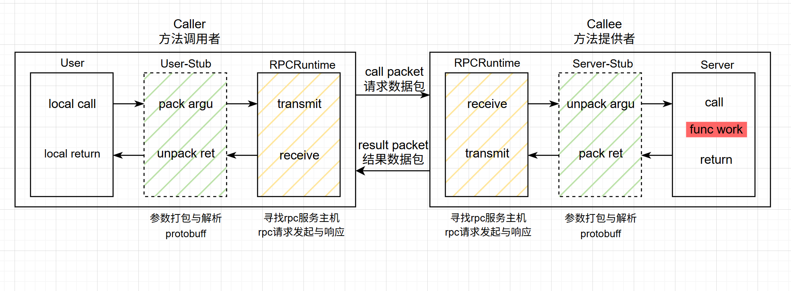

# rpc远程过程调用

---

### 1.RPC远程过程调用

- 绿色部分（序列化/反序列化）：涉及RPC方法参数的打包和解析，利用protobuf实现
- 黄色部分（数据传输网络部分）：网络传输部分，包括寻找rpc服务主机、发起rpc调用请求和响应rpc调用结果，使用muduo网络库实现。

### 2.网络IO模型

1. accpet + read/write

2. accept + fork（process pre connection）

3. accept + thread（thread pre connection）

4. muduo：reactors in threads（one loop per thread）

   主反应堆负责accept连接然后分发到多个sub reactor中，该连接的所有操作都在sub reactor所处的线程中完成，多个连接可能被分派到多个线程中，以充分利用CPU资源。

5. nginx：reactors in process（one loop per process）

   nginx服务器的网络模块基于进程设计，采用多个Reactors充当IO进程和工作进程，通过accept锁解决多个Reactors的惊群现象。

### 3.将本地服务发布成PRC服务

通过此框架可以将上层应用的本地方法，快速的部署成PRC方法，框架不处理任何业务。

